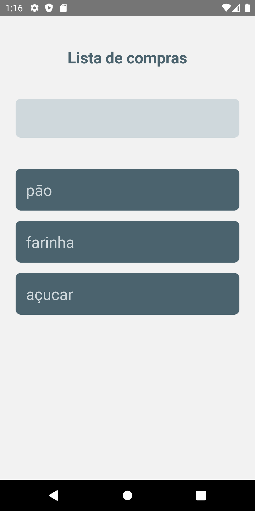

<h1 align="center">
  Shopping List
</h1>

<p align="center">
  <a href="#rocket-project">Project</a>&nbsp;&nbsp;&nbsp;|&nbsp;&nbsp;&nbsp;
  <a href="#computer-technologies">Technologies</a>&nbsp;&nbsp;&nbsp;|&nbsp;&nbsp;&nbsp;
  <a href="#thinking-how-to-use">How to use?</a>&nbsp;&nbsp;&nbsp;|&nbsp;&nbsp;&nbsp;
  <a href="#memo-license">License</a>
</p>

## :rocket: Project

:globe_with_meridians:
Never forget your shopping list at home!

## Preview

<div style="display: flex">

</div>

## :computer: Technologies

- [React Native](https://facebook.github.io/react-native/)
- [Watermelon DB](https://nozbe.github.io/WatermelonDB/)

## :thinking: How to use?

```sh
yarn (or npm i)
```

```sh
yarn android
```

## :memo: License

MIT
